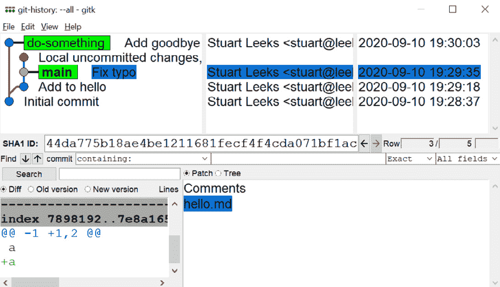
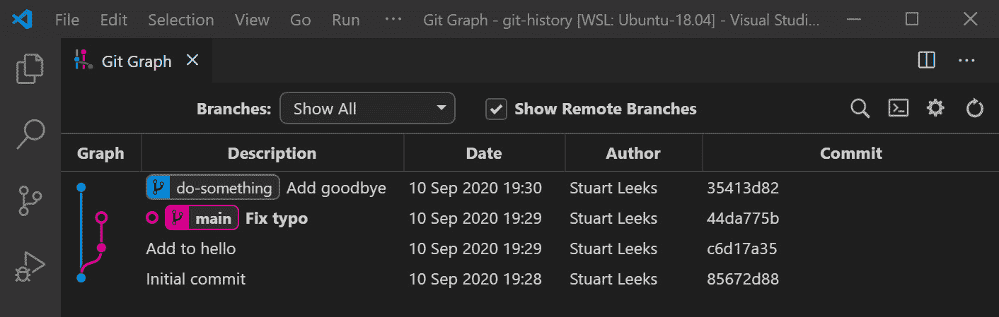
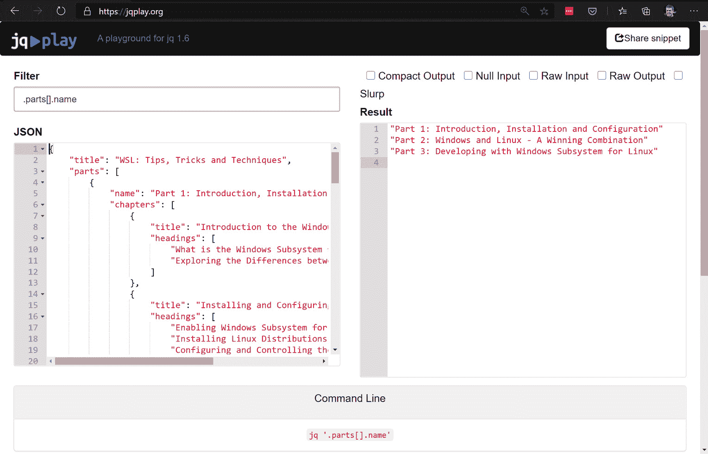
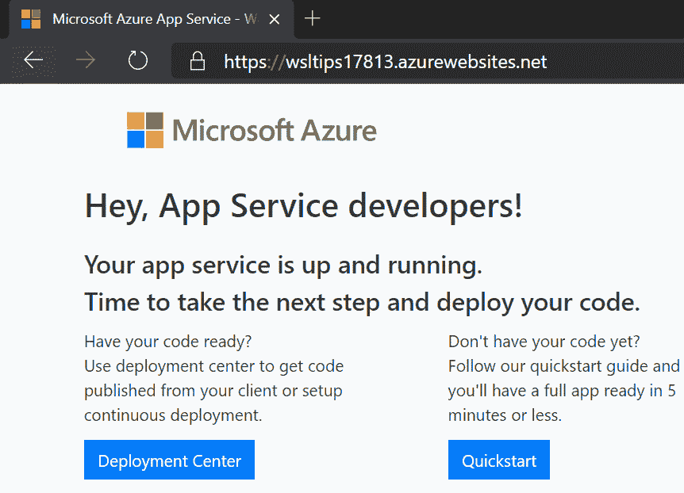
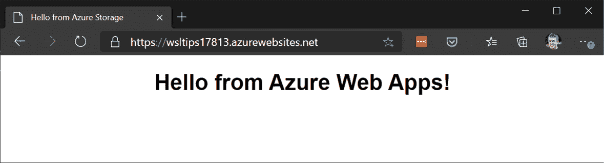

# 第十一章：*第十一章*：命令行工具的生产力技巧

在本章中，我们将涵盖一些使用几种不同常见命令行工具的技巧。我们将首先看看如何提高在 WSL 中使用 Git 的生产力和改善体验。Git 被广泛使用，通过提高使用它进行源代码控制的任何项目的生产力，都会得到改善。之后，我们将看看 Azure 的`az`和 Kubernetes 的`kubectl`。对于这两个 CLI，我们将部署一个简单的示例资源，然后展示一些使用它们查询数据的技巧。与许多 CLI 一样，`az`和`kubectl`都提供了在`az`或`kubectl`中获取数据的选项，这些部分涵盖的技术可能与您正在使用的其他 CLI 相关。通过有效地学习如何操作 JSON，您可以打开使用各种 API 和 CLI 进行脚本编写和自动化的新可能性。

在本章中，我们将涵盖以下主要主题：

+   使用 Git

+   使用 JSON

+   使用 Azure CLI（`az`）

+   使用 Kubernetes CLI（`kubectl`）

让我们开始探索一些使用 Git 的技巧。

# 使用 Git

毫无疑问，Git 是一个常用的源代码控制系统。最初由 Linus Torvalds 编写用于 Linux 内核源代码，现在被广泛使用，包括微软等公司，它被广泛使用，包括用于 Windows 开发（有关更多信息，请参阅[`docs.microsoft.com/en-us/azure/devops/learn/devops-at-microsoft/use-git-microsoft`](https://docs.microsoft.com/en-us/azure/devops/learn/devops-at-microsoft/use-git-microsoft)）。

在本节中，我们将看一些在 WSL 中使用 Git 的技巧。一些技巧在之前的章节中已经涵盖，并提供了进一步的信息链接，而另一些是新技巧 - 这两者在这里都联系在一起，方便参考。

让我们从大多数命令行工具的快速胜利开始：bash 自动补全。

## Git 的 Bash 自动补全

在使用许多命令行工具时，bash 自动补全可以节省大量的输入时间，`git`也不例外。

例如，`git com<TAB>`将产生`git commit`，而`git chec<TAB>`将产生`git checkout`。如果你输入的部分命令不足以指定单个命令，那么 bash 自动补全似乎不会做任何事情，但按两次*Tab*将显示选项。举个例子：

```
$ git co<TAB><TAB>
commit   config
$ git co
```

在这里，我们看到`git co`可以完成为`git commit`或`git config`。

Bash 自动补全不仅仅是完成命令名称；你可以使用`git checkout my<TAB>`来完成分支名称为`git checkout my-branch`。

一旦你习惯了 bash 自动补全，你会发现它可以大大提高生产力！

接下来，让我们看看与远程 Git 仓库进行身份验证的选项。

## 使用 Git 进行身份验证

通过**Secure Shell**（**SSH**）密钥进行 Git 身份验证是一种强大的方法。这种身份验证方法重用 SSH 密钥，通常用于与远程机器建立 SSH 连接，以通过 Git 进行身份验证，并且受到主要的 Git 源代码控制提供者的支持。在*第五章*，*Linux 与 Windows 的互操作性*，在*SSH 代理转发*部分，我们看到如何配置 WSL 以重用存储在 Windows 中的 SSH 密钥。如果你已经设置了这个，它还可以让你在 WSL 中使用 SSH 密钥。

或者，如果您在 Windows 和 WSL 之间进行混合开发并希望在它们之间共享 Git 身份验证，则可能希望为 WSL 配置 Windows 的 Git 凭据管理器。这也支持在 GitHub 或 Bitbucket 等提供商上使用双因素身份验证（有关更多信息，请参见[`github.com/Microsoft/Git-Credential-Manager-for-Windows`](https://github.com/Microsoft/Git-Credential-Manager-for-Windows)）。要使用此功能，您必须在 Windows 中安装 Git。要配置，请从您的**distribution**（**distro**）运行以下命令：

```
git config --global credential.helper "/mnt/c/Program\ Files/Git/mingw64/libexec/git-core/git-credential-manager.exe"
```

此命令将 Git 配置为启动 Git Credential Manager for Windows 来处理与远程存储库的身份验证。通过 Windows 访问 Git 远程存储库存储的任何凭据将被 WSL 重用（反之亦然）。有关更多详细信息，请参见[`docs.microsoft.com/en-us/windows/wsl/tutorials/wsl-git#git-credential-manager-setup`](https://docs.microsoft.com/en-us/windows/wsl/tutorials/wsl-git#git-credential-manager-setup)。

认证问题解决后，让我们看一下在 Git 中查看历史的几个选项。

## 查看 Git 历史

在 WSL 中使用 Git 时，有许多不同的方法可以查看 Git 存储库中提交的历史记录。在这里，我们将看看以下不同的选项：

+   使用`git` CLI

+   使用 Windows 的图形 Git 工具

+   使用 Visual Studio Code Remote-WSL

第一个选项是在 CLI 中使用`git log`命令：

```
$ git log --graph --oneline --decorate --all
* 35413d8 (do-something) Add goodbye
| * 44da775 (HEAD -> main) Fix typo
| * c6d17a3 Add to hello
|/
* 85672d8 Initial commit
```

在`git log`的输出中，您可以看到使用一些附加开关运行`git log`命令产生了简洁的输出，使用文本艺术来显示分支。这种方法很方便，因为它可以直接从 WSL 的命令行中使用，并且除了 WSL 中安装的 Git 之外不需要安装任何东西。但是，这个命令可能有点繁琐，所以您可能希望创建一个 Git 别名，如下所示：

```
$ git config --global --replace-all alias.logtree 'log --graph --oneline --decorate --all'
```

在这里，我们使用`git config`命令为先前的 Git 命令创建了一个名为`logtree`的别名。创建后，我们现在可以运行`git logtree`来生成先前的输出。

如果您在 Windows 上使用 Git 的图形工具，您可以将其指向 WSL 中的 Git 存储库。在第九章《Visual Studio Code 和 WSL》的《查看 Git 历史》部分中，我们看到了如何使用 Git 附带的`gitk`实用程序。例如，我们可以从 WSL shell 中的 Git 存储库文件夹运行`gitk.exe --all`来启动 Windows 的`gitk.exe`可执行文件：



图 11.1 - 显示 Windows 中 gitk 实用程序的屏幕截图，显示了 WSL Git 存储库

在这个屏幕截图中，我们可以看到`gitk`实用程序在 Windows 中运行，并显示了之前使用`git log`看到的相同的 Git 存储库。因为我们是从 WSL 的 shell 中启动它的，它捕获了`\\wsl$`共享，用于从 Windows 访问 WSL 中的 shell 当前文件夹（有关`\\wsl$`共享的更多信息，请参见第四章《Windows 到 Linux 的互操作性》，《从 Windows 访问 Linux 文件》部分）。这种方法的一个潜在问题是通过`\\wsl$`共享访问文件会有性能开销，对于大型 Git 存储库，这可能会使 Windows 的 Git 工具加载缓慢。

我们在第九章《Visual Studio Code 和 WSL》的《查看 Git 历史》部分中看到的另一个选项是使用 Visual Studio Code。通过使用 Remote-WSL 扩展，我们可以安装其他扩展程序，使它们实际在 WSL 中运行。**Git Graph 扩展程序**是 Visual Studio Code 的一个方便的补充，允许您以图形方式查看 Git 历史，并且与 Remote-WSL 配合良好。您可以在这里看到一个例子：



图 11.2 – 显示 Visual Studio Code 中的 Git Graph 扩展的屏幕截图

这个屏幕截图再次显示了相同的 Git 存储库，但这次是在 Visual Studio Code 中使用 Git Graph 扩展。由于这个扩展是通过 Remote-WSL 在 WSL 中加载的，所有对 Git 存储库的访问都是直接在 WSL 中执行的，而不会通过 `\\wsl$` 共享进行查询时的性能开销。

在这里我们看到了一些方法，每种方法都有其自身的好处，在各自的上下文中都很有用。*Git CLI* 方法在你已经在终端时很方便，并且它在 WSL 中运行，因此性能很好。对于检查复杂的分支和历史记录，图形工具往往是最好的选择。然而，正如前面提到的，从 Windows 使用图形 Git 工具会产生 `\\wsl$` 共享的性能开销 – 通常情况下这是不明显的，但对于文件或历史记录很多的 Git 存储库来说，它可能开始变得更加显著。在这些情况下，或者当我已经在编辑器中工作时，我发现 Visual Studio Code 的 Git Graph 等扩展非常有用，它提供了图形化的可视化，而没有性能开销。

接下来，我们将看看在使用 Git 时改进我们的 bash 提示。

## bash 提示中的 Git 信息

在 Git 存储库中的文件夹中使用 bash 时，默认提示不会给出有关 Git 存储库状态的任何提示。有各种选项可以将 Git 存储库的上下文添加到 bash 中，我们将在这里看一些选项。第一个选项是 **bash-git-prompt** (https://github.com/magicmonty/bash-git-prompt)，它在 Git 存储库中自定义了你的 bash 提示。你可以在这里看到一个例子：


图 11.3 – 显示 bash-git-prompt 的屏幕截图

正如这个屏幕截图所示，`bash-git-prompt` 显示了你当前所在的分支（在这个例子中是 `main`）。它还指示了你的本地分支是否有提交要推送，或者是否有要从远程分支拉取的提交，通过上下箭头来表示。上箭头表示有提交要推送，下箭头表示有提交要拉取。最后，它显示了你是否有未提交的本地更改 – 在这个例子中是 `+1`。

要安装 `bash-git-prompt`，首先使用以下命令克隆存储库：

```
git clone https://github.com/magicmonty/bash-git-prompt.git ~/.bash-git-prompt --depth=1
```

这个 `git clone` 命令将存储库克隆到用户文件夹中的 `.bash-git-prompt` 文件夹中，并使用 `--depth=1` 仅拉取最新的提交。

接下来，在你的用户文件夹中的 `.bashrc` 中添加以下内容：

```
if [ -f "$HOME/.bash-git-prompt/gitprompt.sh" ]; then
    GIT_PROMPT_ONLY_IN_REPO=1
    source $HOME/.bash-git-prompt/gitprompt.sh
fi
```

这个片段将 `GIT_PROMPT_ONLY_IN_REPO` 变量设置为仅在带有 Git 存储库的文件夹中使用自定义提示，然后加载 `git` 提示。现在，重新打开你的终端并切换到一个 Git 存储库的文件夹中，看看 `bash-git-prompt` 的效果。有关其他配置选项，请参阅 [`github.com/magicmonty/bash-git-prompt`](https://github.com/magicmonty/bash-git-prompt) 上的文档。

丰富你的 bash 提示的另一个选项是 `bash-git-prompt`，它接管了你的一般提示体验，为提示添加了 Git 和 Kubernetes 等内容。在下面的屏幕截图中可以看到 Powerline 提示的一个例子：


图 11.4 – 显示 Powerline 提示的屏幕截图

正如这个屏幕截图所示，Powerline 使用了一些特殊的字体字符，并非所有字体都设置了这些字符，所以第一步是确保我们有一个合适的字体。Windows 终端附带了一个名为 `CascadiaCodePL.ttf` 和 `CascadiaMonoPL.ttf` 的字体，可以通过在 **Windows Explorer** 中右键单击 `ttf` 文件夹中的文件并选择 **安装** 来安装。

安装了 Powerline 字体后，我们需要配置终端来使用它。如果你正在使用 Windows 终端，那么启动它并按下 *Ctrl* + *,* 加载设置，并添加以下内容：

```
"profiles": {
    "defaults": {
        "fontFace": "Cascadia Mono PL"
    },
```

在这里，我们将默认的`fontFace`值设置为我们刚安装的`Cascadia Mono PL`（Powerline）字体。要更改单个配置文件的字体，请参见*第三章*，*开始使用 Windows 终端*，*更改字体*部分。

现在我们已经设置了一个带有 Powerline 字体的终端，我们可以安装 Powerline。有几种变体，我们将使用来自[`github.com/justjanne/powerline-go/releases`](https://github.com/justjanne/powerline-go/releases)的`powerline-go-linux-amd64`版本，并将其保存为`powerline-go`，放在 WSL 发行版的`PATH`中的某个位置，例如`/usr/local/bin`。（另一种选择是通过**Go**安装，但发行版存储库可能停留在旧版本的 Go 上，导致不兼容-如果您更喜欢尝试此选项，请参考 Windows 终端文档：[`docs.microsoft.com/en-us/windows/terminal/tutorials/powerline-setup`](https://docs.microsoft.com/en-us/windows/terminal/tutorials/powerline-setup)。）

安装了`powerline-go`后，我们可以通过将以下内容添加到`bashrc`来配置 bash 使用它：

```
function _update_ps1() {
    PS1="$(powerline-go -error $?)"
}
if [ "$TERM" != "linux" ] && [ "$(command -v powerline-go > /dev/null 2>&1; echo $?)" == "0" ]; then
    PROMPT_COMMAND="_update_ps1; $PROMPT_COMMAND"
fi
```

在这里，我们创建了一个`_update_ps1`函数，调用了`powerline-go`。这是添加额外开关以控制`powerline-go`行为的地方-有关更多详细信息，请参阅文档：[`github.com/justjanne/powerline-go#customization`](https://github.com/justjanne/powerline-go#customization)。

在使用 Git 时，调整提示以自动获取 Git 仓库的上下文可以使您更轻松地选择任何选项。将此与在 Git 中设置身份验证以在 Windows 和 WSL 之间共享，并了解在不同情况下如何最好地查看 Git 历史记录相结合，您将能够在 WSL 中高效地使用 Git。

在下一节中，我们将看一下几种处理 JSON 数据的方法。

# 处理 JSON

自动化复杂任务可以节省数小时的手动劳动。在本节中，我们将探讨一些处理 JSON 数据的技术，这是许多命令行工具和 API 允许您使用的常见格式。在本章后面，我们将展示一些示例，说明您可以如何使用这些技术轻松地创建和发布内容到云网站或 Kubernetes 集群。

对于本节，书籍的附带代码中有一个示例 JSON 文件。您可以使用 Git 从[`github.com/PacktPublishing/Windows-Subsystem-for-Linux-2-WSL-2-Tips-Tricks-and-Techniques`](https://github.com/PacktPublishing/Windows-Subsystem-for-Linux-2-WSL-2-Tips-Tricks-and-Techniques)克隆此代码。示例 JSON 名为`wsl-book.json`，位于`chapter-11/02-working-with-json`文件夹中，基于一本书的章节和标题的 JSON 描述。此处显示了此 JSON 的片段：

```
{
    "title": "WSL: Tips, Tricks and Techniques",
    "parts": [
        {
            "name": "Part 1: Introduction, Installation and Configuration",
            "chapters": [
                {
                    "title": "Introduction to the Windows Subsystem for Linux",
                    "headings": [
                        "What is the Windows Subsystem for Linux?",
                        "Exploring the Differences between WSL 1 and 2"
                    ]
                },
			...
            "name": "Part 2: Windows and Linux - A Winning Combination",
            "chapters": [
                {
			...
```

此片段显示了示例 JSON 的结构。值得花一些时间熟悉它，因为它是本节示例的基础。本节中的示例假定您在包含示例 JSON 的文件夹中打开了一个 shell。

让我们开始使用一个流行的实用程序`jq`。

## 使用 jq

我们将首先看一下`jq`，它是一个非常方便的用于处理 JSON 字符串的实用程序，并且在主要平台上都受支持。完整的安装选项列在[`stedolan.github.io/jq/download/`](https://stedolan.github.io/jq/download/)上，但您可以通过在 Debian/Ubuntu 上运行`sudo apt-get install jq`来快速开始。

在其最基本的形式中，`jq`可用于格式化输入。例如，我们可以将 JSON 字符串传输到`jq`中：

```
$ echo '[1,2,"testing"]' | jq
[
  1,
  2,
  "testing"
]
```

在这个命令的输出中，你可以看到`jq`已经将紧凑的 JSON 输入转换成了格式良好的输出。当与返回紧凑 JSON 的 API 进行交互时，这个功能本身就很有用。然而，`jq`真正的威力在于它的查询能力，我们将在本节中探讨这些能力。作为一个可以实现的预演，看一下下面的例子：

```
$ cat ./wsl-book.json | jq ".parts[].name"
"Part 1: Introduction, Installation and Configuration"
"Part 2: Windows and Linux - A Winning Combination"
"Part 3: Developing with Windows Subsystem for Linux"
```

这个输出显示了`jq`提取和输出样本 JSON 中部件的`name`值。当使用返回 JSON 数据的 API 和命令行工具进行脚本编写时，这种能力非常有用，我们将从一些简单的查询开始，逐渐发展到更复杂的查询。你可以使用`jq` CLI 或者在[`jqplay.org`](https://jqplay.org)上使用**jq playground**来跟随这些例子，就像在这里的截图中看到的那样。



图 11.5 - 展示 jq playground 的截图

这个截图显示了在`jq` playground 中打开的前面的例子。在左上角，你可以看到过滤器（`.parts[].name`），在下面是输入的 JSON，右边是`jq`的输出。当你在处理复杂的查询时，playground 可以是一个有用的环境，底部的**命令行**部分甚至会给出你可以复制并在脚本中使用的命令行。

现在你已经知道`jq`可以做什么了，让我们从一个简单的查询开始。我们要处理的 JSON 有两个顶级属性：`title`和`parts`。如果我们想提取`title`属性的值，我们可以使用以下查询：

```
$ cat ./wsl-book.json | jq ".title"
"WSL: Tips, Tricks and Techniques"
```

在这里，我们使用了`.title`过滤器来提取`title`属性的值。注意输出中的值被引号引起来，因为`jq`默认输出 JSON。在脚本中将这个值赋给一个变量时，通常希望得到没有引号的值，我们可以使用`jq`的`-r`选项来获得原始输出：

```
$ BOOK_TITLE=$(cat ./wsl-book.json | jq ".title" -r)
$ echo $BOOK_TITLE
WSL: Tips, Tricks and Techniques
```

这个输出显示了使用`-r`选项来获得原始（未引用）输出并将其赋给一个变量。

在这个例子中，我们使用了`title`属性，它是一个简单的字符串值。另一个顶级属性是`parts`，它是一个 JSON 对象的数组：

```
$ cat ./wsl-book.json | jq ".parts"
[
  {
    "name": "Part 1: Introduction, Installation and Configuration",
    "chapters": [
      {
        "title": "Introduction to the Windows Subsystem for Linux",
        "headings": [
          "What is the Windows Subsystem for Linux?",
          "Exploring the Differences between WSL 1 and 2"
        ]
      },
	...
```

在这个命令的输出中，我们看到检索`parts`属性返回了属性的完整值。我们可以将过滤器更改为`.parts[0]`来获取`parts`数组中的第一个项目，然后进一步扩展过滤器，如果我们想要获取第一个部件的名称，就像这样：

```
$ cat ./wsl-book.json | jq ".parts[0].name"
"Part 1: Introduction, Installation and Configuration"
```

在这里，我们看到了如何构建一个查询来沿着 JSON 数据的层次结构进行选择属性和索引数组以选择特定的值。有时候能够获得一个数据列表是很有用的 - 例如，获取所有部件的名称。我们可以使用以下命令来实现：

```
$ cat ./wsl-book.json | jq ".parts[].name"
"Part 1: Introduction, Installation and Configuration"
"Part 2: Windows and Linux - A Winning Combination"
"Part 3: Developing with Windows Subsystem for Linux"
```

正如你在这个例子中看到的，我们省略了前一个过滤器中的数组索引，`jq`已经处理了剩下的过滤器（`.name`）并针对`parts`数组的每个项目进行了处理。与单一值输出一样，我们可以添加`-r`选项，以便在脚本中更容易地处理输出的未引用字符串。或者，如果我们正在处理 API，我们可能希望构建 JSON 输出 - 例如，要将前面的值输出为数组，我们可以将过滤器包装在方括号中：`[.parts[].name]`。

到目前为止，我们只使用了一个单一的过滤表达式，但是`jq`允许我们将多个过滤器链接在一起，并将一个过滤器的输出作为下一个过滤器的输入。例如，我们可以将`.parts[].name`重写为`.parts[] | .name`，这将产生相同的输出。从这里，我们可以将第二个过滤器改为`{name}`，以产生一个带有`name`属性的对象，而不仅仅是名称值：

```
$ cat ./wsl-book.json | jq '.parts[] | {name}'
{
  "name": "Part 1: Introduction, Installation and Configuration"
}
{
  "name": "Part 2: Windows and Linux - A Winning Combination"
}
{
  "name": "Part 3: Developing with Windows Subsystem for Linux"
}
```

在这里，我们看到`.parts`数组中的每个值现在都产生了输出中的一个对象，而不仅仅是之前的简单字符串。`{name}`语法实际上是`{name: .name}`的简写。完整的语法使您更容易看到如何控制输出中的属性名称 - 例如，`{part_name: .name}`。使用完整的语法，我们还可以看到属性值是另一个过滤器。在这个例子中，我们使用了简单的`.name`过滤器，但我们也可以使用更丰富的过滤器来构建：

```
$ cat ./wsl-book.json | jq '.parts[] | {name: .name, chapter_count: .chapters | length}'
{
  "name": "Part 1: Introduction, Installation and Configuration",
  "chapter_count": 3
}
{
  "name": "Part 2: Windows and Linux - A Winning Combination",
  "chapter_count": 5
}
{
  "name": "Part 3: Developing with Windows Subsystem for Linux",
  "chapter_count": 3
}
```

在这个例子中，我们添加了`.chapters | length`作为一个过滤器来指定`chapter_count`属性的值。`.chapters`表达式被应用于当前正在处理的`parts`数组的值，并选择`chapters`数组，然后将其解析为`length`函数，该函数返回数组长度。有关`jq`中可用函数的更多信息，请查看 https://stedolan.github.io/jq/manual/#Builtinoperatorsandfunctions 上的文档。

作为`jq`的最后一个例子，让我们汇总一下部分的摘要，显示部分名称以及章节标题的列表：

```
$ cat ./wsl-book.json | jq '[.parts[] | {name: .name, chapters: [.chapters[] | .title]}]'
[
  {
    "name": "Part 1: Introduction, Installation and Configuration",
    "chapters": [
      "Introduction to the Windows Subsystem for Linux",
      "Installing and Configuring the Windows Subsystem for Linux",
      "Getting Started with Windows Terminal"
    ]
  },
  {
    "name": "Part 2: Windows and Linux - A Winning Combination",
    "chapters": [
...
]
```

在这个例子中，`parts`数组被传递到一个过滤器中，该过滤器为每个数组项创建一个带有`name`和`chapters`属性的对象。`chapters`属性是通过将`chapters`数组传递到`title`属性的选择器中，然后将其包装在一个数组中来构建的：`[.chapters[] | title]`。整个结果再次被包装在一个数组中（再次使用方括号）以在输出中创建这些摘要对象的 JSON 数组。

提示

有各种方法可以使用命令行工具（如`jq`）查找选项。您可以运行`jq --help`获取简要的帮助页面，或者运行`man jq`查看完整的 man 页面。这些的一个方便的替代品是`tldr`（有关更多详细信息和安装说明，请参见[`tldr.sh`](https://tldr.sh)）。`tldr`实用程序将自己描述为*简化和社区驱动的 man 页面*，运行`tldr jq`将提供比 man 页面更短的输出，并包含有用的示例。

这次风风火火的旅行向您展示了`jq`提供的一些功能，无论是在与 JSON 交互式工作时格式化 JSON 输出以便阅读，还是快速选择 JSON 中的单个值以在脚本中使用，或者将 JSON 输入转换为新的 JSON 文档时。在处理 JSON 时，`jq`是一个非常有用的工具，我们将在本章的后续部分中看到更多这方面的例子。

在下一节中，我们将探索使用**PowerShell**处理 JSON 数据的选项。

## 使用 PowerShell 处理 JSON

在本节中，我们将探讨 PowerShell 为我们提供的一些处理 JSON 数据的能力。PowerShell 是一个起源于 Windows 但现在可用于 Windows、Linux 和 macOS 的 shell 和脚本语言。要在 WSL 中安装，请按照您的发行版的安装说明进行安装，网址为 https://docs.microsoft.com/en-us/powershell/scripting/install/installing-powershell-core-on-linux?view=powershell-7。例如，对于 Ubuntu 18.04，我们可以使用以下命令安装 PowerShell：

```
# Download the Microsoft repository GPG keys wget -q https://packages.microsoft.com/config/ubuntu/18.04/packages-microsoft-prod.deb
# Register the Microsoft repository GPG keys sudo dpkg -i packages-microsoft-prod.deb
# Update the list of products sudo apt-get update
# Enable the "universe" repositories sudo add-apt-repository universe
# Install PowerShell sudo apt-get install -y powershell
```

这些步骤将注册 Microsoft 软件包存储库，然后从那里安装 PowerShell。安装完成后，您可以通过运行`pwsh`来启动 PowerShell，这将为您提供一个交互式的 shell，我们将在本节的其余示例中使用它。

我们可以按如下方式加载和解析示例 JSON 文件：

```
PS > Get-Content ./wsl-book.json | ConvertFrom-Json
title                            parts
-----                            -----
WSL: Tips, Tricks and Techniques {@{name=Part 1: Introduction, Installation and Configuration; chapters=System.Object[…
```

在这里，我们看到了`Get-Content` cmdlet（PowerShell 中的命令称为`ConvertFrom-Json`用于将 JSON 对象图解析为 PowerShell 对象。在这一点上，我们可以使用任何用于处理数据的 PowerShell 功能。例如，我们可以使用`Select-Object` cmdlet 获取标题：

```
PS > Get-Content ./wsl-book.json | ConvertFrom-Json | Select-Object -ExpandProperty title
WSL: Tips, Tricks and Techniques
```

`Select-Object`命令允许我们对一组对象执行各种操作，例如从集合的开头或结尾获取指定数量的项目，或者仅筛选唯一的项目。在这个例子中，我们使用它来选择要输出的输入对象的属性。获取标题的另一种方法是直接使用转换后的 JSON 对象，如下面的命令所示：

```
PS > $data = Get-Content ./wsl-book.json | ConvertFrom-Json
PS > $data.title
WSL: Tips, Tricks and Techniques
```

在这个例子中，我们保存了将数据从 JSON 转换为`$data`变量的结果，然后直接访问了`title`属性。现在我们有了`$data`变量，我们可以探索`parts`属性：

```
PS > $data.parts | Select-Object -ExpandProperty name
Part 1: Introduction, Installation and Configuration
Part 2: Windows and Linux - A Winning Combination
Part 3: Developing with Windows Subsystem for Linux
```

在这个例子中，我们直接访问`parts`属性，这是一个对象数组。然后我们将这个对象数组传递给`Select-Object`来展开每个部分的`name`属性。如果我们想生成 JSON 输出（就像在上一节中使用`jq`一样），我们可以使用`ConvertTo-Json`命令：

```
PS > $data.parts | select -ExpandProperty name | ConvertTo-Json
[
  "Part 1: Introduction, Installation and Configuration",
  "Part 2: Windows and Linux - A Winning Combination",
  "Part 3: Developing with Windows Subsystem for Linux"
]
```

在这里，我们使用了与上一个示例中相同的命令（尽管我们使用了`select`别名作为`Select-Object`的简洁形式），然后将输出传递给`ConvertTo-Json`命令。这个命令执行与`ConvertFrom-Json`相反的操作-换句话说，它将一组 PowerShell 对象转换为 JSON。

如果我们想要输出带有部分名称的 JSON 对象，可以使用以下命令：

```
PS > $data.parts | ForEach-Object { @{ "Name" = $_.name } } | ConvertTo-Json
[
  {
    "Name": "Part 1: Introduction, Installation and Configuration"
  },
  {
    "Name": "Part 2: Windows and Linux - A Winning Combination"
  },
  {
    "Name": "Part 3: Developing with Windows Subsystem for Linux"
  }
]
```

在这里，我们使用`ForEach-Object`而不是`Select-Object`。`ForEach-Object`命令允许我们为输入数据中的每个对象提供一个 PowerShell 片段，并且`$_`变量包含每次执行的集合中的项目。在`ForEach-Object`内部的片段中，我们使用`@{ }`语法创建一个名为`Name`的新 PowerShell 对象属性，该属性设置为当前输入对象的`name`属性（在这种情况下是部分名称）。最后，我们将生成的对象集传递给`ConvertTo-Json`以转换为 JSON 输出。

我们可以使用这种方法来构建更丰富的输出-例如，包括部分名称以及它包含的章节数：

```
PS > $data.parts | ForEach-Object { @{ "Name" = $_.name; "ChapterCount"=$_.chapters.Count } } | ConvertTo-Json
[
  {
    "ChapterCount": 3,
    "Name": "Part 1: Introduction, Installation and Configuration"
  },
  {
    "ChapterCount": 5,
    "Name": "Part 2: Windows and Linux - A Winning Combination"
  },
  {
    "ChapterCount": 3,
    "Name": "Part 3: Developing with Windows Subsystem for Linux"
  }
]
```

在这个例子中，我们扩展了`ForEach-Object`内部的片段到`@{ "Name" = $_.name; "ChapterCount"=$_.chapters.Count }`。这将创建一个具有两个属性的对象：`Name`和`ChapterCount`。`chapters`属性是一个 PowerShell 数组，因此我们可以使用数组的`Count`属性作为输出中`ChapterCount`属性的值。

如果我们想要输出每个部分的章节名称的摘要，我们可以结合我们迄今为止看到的方法：

```
PS > $data.parts | ForEach-Object { @{ "Name" = $_.name; "Chapters"=$_.chapters | Select-Object -ExpandProperty title } } | ConvertTo-Json
[
  {
    "Chapters": [
      "Introduction to the Windows Subsystem for Linux",
      "Installing and Configuring the Windows Subsystem for Linux",
      "Getting Started with Windows Terminal"
    ],
    "Name": "Part 1: Introduction, Installation and Configuration"
  },
  {
    "Chapters": [
...
    ],
    "Name": "Part 2: Windows and Linux - A Winning Combination"
  },
  ...
]
```

在这里，我们再次使用`ForEach-Object`命令来创建 PowerShell 对象，这次使用`Name`和`Chapters`属性。要创建`Chapters`属性，我们只需获取每个章节的名称，我们可以像在本节前面选择部分名称时一样使用`Select-Object`命令，但这次我们将其用在`ForEach-Object`片段内。能够以这种方式组合命令使我们具有很大的灵活性。

在之前的例子中，我们一直在处理使用`Get-Content`从本地文件加载的数据。要从 URL 下载数据，PowerShell 提供了一些方便的命令：`Invoke-WebRequest`和`Invoke-RestMethod`。

我们可以使用`Invoke-WebRequest`从 GitHub 下载示例数据：

```
$SAMPLE_URL="https://raw.githubusercontent.com/PacktPublishing/Windows-Subsystem-for-Linux-2-WSL-2-Tips-Tricks-and-Techniques/main/chapter-11/02-working-with-json/wsl-book.json"
PS > Invoke-WebRequest $SAMPLE_URL
StatusCode        : 200
StatusDescription : OK
Content           : {
                        "title": "WSL: Tips, Tricks and Techniques",
                        "parts": [
                            {
                                "name": "Part 1: Introduction, Installation and Configuration",
                                "chapters": [
                                    {
                        …
RawContent        : HTTP/1.1 200 OK
                    Connection: keep-alive
                    Cache-Control: max-age=300
                    Content-Security-Policy: default-src 'none'; style-src 'unsafe-inline'; sandbox
                    ETag: "075af59ea4d9e05e6efa0b4375b3da2f8010924311d487d…
Headers           : {[Connection, System.String[]], [Cache-Control, System.String[]], [Content-Security-Policy, System.String[]], [ETag, System.Strin                     g[]]…}
Images            : {}
InputFields       : {}
Links             : {}
RawContentLength  : 4825
RelationLink      : {}
```

在这里，我们看到`Invoke-WebRequest`使我们可以访问响应的各种属性，包括状态代码和内容。要将数据加载为 JSON，我们可以将`Content`属性传递给`ConvertFrom-JSON`：

```
PS > (iwr $SAMPLE_URL).Content | ConvertFrom-Json
                                                                                                                                                     title                           parts
-----                            -----
WSL: Tips, Tricks and Techniques {@{name=Part 1: Introduction, Installation and Configuration; chapters=System.Object[]}, @{name=Part 2: Windows and…
```

在这个例子中，我们使用了`iwr`别名作为`Invoke-WebRequest`的简写，这在交互式工作时可能很方便。我们本可以将`Invoke-WebRequest`的输出传递给`Select-Object`来展开`Content`属性，就像我们之前看到的那样。相反，我们将表达式括在括号中，直接访问属性以显示另一种语法。然后将此内容传递给`ConvertFrom-Json`，将数据转换为 PowerShell 对象，就像我们之前看到的那样。这种可组合性很方便，但如果您只对 JSON 内容感兴趣（而不关心响应的其他属性），那么您可以使用`Invoke-RestMethod`命令来实现这一点：

```
PS > Invoke-RestMethod $SAMPLE_URL
title                            parts
-----                            -----
WSL: Tips, Tricks and Techniques {@{name=Part 1: Introduction, Installation and Configuration; chapters=System.Object[]}, @{name=Part 2: Windows and…
```

在这里，我们看到与之前相同的输出，因为`Invoke-RestMethod`命令已经确定响应包含 JSON 数据，并自动执行了转换。

## 总结使用 JSON

在最后两节中，您已经看到了`jq`和 PowerShell 如何为您提供处理 JSON 输入的丰富功能。在每种情况下，您已经看到如何提取简单的值，并执行更复杂的操作以生成新的 JSON 输出。由于 JSON 在 API 和 CLI 中被广泛使用，能够有效地处理 JSON 是一个巨大的生产力提升，正如我们将在本章的其余部分中看到的那样。在本章的其余部分，我们将在需要额外工具来处理 JSON 的示例中使用`jq`，但请注意，您也可以使用 PowerShell 来实现这一点。

在下一节中，我们将看到如何将处理 JSON 的技术与另一个命令行工具结合使用，这次是一些处理 Azure CLI 的技巧。

# 使用 Azure CLI（az）

云计算的推动带来了许多好处，其中包括能够按需创建计算资源的能力。能够自动化创建、配置和删除这些资源是利益的关键部分，这通常是使用相关云供应商提供的 CLI 来执行的。

在本节中，我们将从命令行创建和发布一个简单的网站，并将其作为查看使用 Azure CLI（az）的一些技巧的方式。我们将看到如何使用本章前面看到的`jq`以及`az`的内置查询功能。如果您想跟着做，但还没有 Azure 订阅，您可以在 https://azure.microsoft.com/free/免费试用。让我们开始安装 CLI。

## 安装和配置 Azure CLI

安装 Azure CLI 有多种选项。最简单的方法是在您想要安装 CLI 的 WSL 分发中打开终端，并运行以下命令：

```
curl -sL https://aka.ms/InstallAzureCLIDeb | sudo bash
```

此命令下载安装脚本并在 bash 中运行。如果您不想直接从互联网运行脚本，您可以先下载脚本并检查它，或者在这里查看单独的安装步骤：[`docs.microsoft.com/en-us/cli/azure/install-azure-cli-apt?view=azure-cli-latest`](https://docs.microsoft.com/en-us/cli/azure/install-azure-cli-apt?view=azure-cli-latest)。

安装完成后，您应该能够从终端运行`az`。要连接到您的 Azure 订阅，以便管理它，请运行`az login`：

```
$ az login
To sign in, use a web browser to open the page https://microsoft.com/devicelogin and enter the code D3SUM9QVS to authenticate.
```

在`az login`命令的输出中，您可以看到`az`生成了一个代码，我们可以通过访问[`microsoft.com/devicelogin`](https://microsoft.com/devicelogin)来使用该代码登录。在浏览器中打开此网址，并使用您用于 Azure 订阅的帐户登录。在这样做后不久，`az login`命令将输出您的订阅信息并完成运行。

如果您有多个订阅，可以使用`az account list`列出它们，并使用`az account set --subscription YourSubscriptionNameOrId`选择要使用的默认订阅。

现在我们已经登录，可以开始运行命令了。在 Azure 中，资源存放在资源组（逻辑容器）中，所以让我们列出我们的组：

```
$ az group list
[]
```

在这里，命令的输出显示订阅中当前没有资源组。请注意，输出是`[]` - 一个空的 JSON 数组。默认情况下，`az`将结果输出为 JSON，因此对具有一些现有资源组的订阅运行先前的命令会给我们以下输出：

```
$ az group list
[
  {
    "id": "/subscriptions/36ce814f-1b29-4695-9bde-1e2ad14bda0f/resourceGroups/wsltipssite",
    "location": "northeurope",
    "managedBy": null,
    "name": "wsltipssite",
    "properties": {
      "provisioningState": "Succeeded"
    },
    "tags": null,
    "type": "Microsoft.Resources/resourceGroups"
  },
  ...
]
```

前面的输出已经被截断，因为它变得非常冗长。幸运的是，`az`允许我们从多种输出格式中进行选择，包括表格：

```
$ az group list -o table
Name         Location     Status
-----------  -----------  ---------
wsltipssite  northeurope  Succeeded
wsltipstest  northeurope  Succeeded
```

在这个输出中，我们使用了`-o table`开关来配置表格输出。这种输出格式更简洁，通常对 CLI 的交互使用非常方便，但是不得不不断地在命令中添加开关可能会很繁琐。幸运的是，我们可以通过运行`az configure`命令将表格输出设置为默认值。这将为您提供一组简短的交互选择，包括默认使用的输出格式。由于默认输出格式可以被覆盖，因此在脚本中指定 JSON 输出是很重要的，以防用户配置了不同的默认值。

有关使用`az`的更多示例，包括如何在 Azure 中创建各种资源，请参阅[`docs.microsoft.com/cli/azure`](https://docs.microsoft.com/cli/azure)上的*示例*部分。在本节的其余部分，我们将看一些关于使用 CLI 查询有关资源信息的具体示例。

## 创建 Azure Web 应用程序

为了演示使用`az`进行查询，我们将创建一个简单的 Azure Web 应用程序。Azure Web 应用程序允许您托管用各种语言编写的 Web 应用程序（包括.NET、Node.js、PHP、Java 和 Python），并且有许多部署选项可供您根据自己的喜好选择。为了确保我们专注于 CLI 的使用，我们将保持简单，创建一个单页面静态网站，并通过 FTP 部署它。要了解更多关于 Azure Web 应用程序的信息，请参阅[`docs.microsoft.com/en-us/azure/app-service/overview`](https://docs.microsoft.com/en-us/azure/app-service/overview)上的文档。

在创建 Web 应用程序之前，我们需要创建一个资源组：

```
az group create \
        --name wsltips-chapter-11-03 \
        --location westeurope
```

在这里，我们使用`az group create`命令创建一个资源组来包含我们将创建的资源。请注意，我们使用了行继续字符（`\`）将命令分割成多行以便阅读。要运行 Web 应用程序，我们需要一个 Azure 应用服务计划来托管它，所以我们将首先创建它：

```
az appservice plan create \
        --resource-group wsltips-chapter-11-03 \
        --name wsltips-chapter-11-03 \
        --sku FREE
```

在这个片段中，我们使用`az appservice plan create`命令在我们刚刚创建的资源组中创建了一个免费的托管计划。现在，我们可以使用该托管计划创建 Web 应用程序：

```
WEB_APP_NAME=wsltips$RANDOM
az webapp create \
        --resource-group wsltips-chapter-11-03 \
        --plan wsltips-chapter-11-03 \
        --name $WEB_APP_NAME
```

在这里，我们为网站生成一个随机名称（因为它需要是唯一的），并将其存储在`WEB_APP_NAME`变量中。然后我们使用`az webapp create`命令。一旦这个命令完成，我们就创建了一个新的网站，并准备好开始使用`az` CLI 进行查询。

## 查询单个值

我们要查询 Web 应用程序的第一件事是它的 URL。我们可以使用`az webapp show`命令列出我们的 Web 应用程序的各种属性：

```
$ az webapp show \
             --name $WEB_APP_NAME \
             --resource-group wsltips-chapter-11-03 \
             --output json
{
  "appServicePlanId": "/subscriptions/67ce421f-bd68-463d-85ff-e89394ca5ce6/resourceGroups/wsltips-chapter-11-02/providers/Microsoft.Web/serverfarms/wsltips-chapter-11-03",
  "defaultHostName": "wsltips28126.azurewebsites.net",
  "enabled": true,
  "enabledHostNames": [
    "wsltips28126.azurewebsites.net",
    "wsltips28126.scm.azurewebsites.net"
  ],
  "id": "/subscriptions/67ce421f-bd68-463d-85ff-e89394ca5ce6/resourceGroups/wsltips-chapter-11-02/providers/Microsoft.Web/sites/wsltips28126",
   ...
  }
}
```

在这里，我们传递了`--output json`开关，以确保无论配置了什么默认格式，我们都能获得 JSON 输出。在这个简化的输出中，我们可以看到有一个`defaultHostName`属性，我们可以用它来构建我们网站的 URL。

提取`defaultHostName`属性的一种方法是使用`jq`，就像我们在*使用 jq*部分中看到的那样：

```
$ WEB_APP_URL=$(az webapp show \
             --name $WEB_APP_NAME \
             --resource-group wsltips-chapter-11-03 \
             --output json  \
             | jq ".defaultHostName" -r)
```

在这个片段中，我们使用`jq`选择`defaultHostName`属性，并传递`-r`开关以获得原始输出，避免它被引用，然后将其分配给`WEB_APP_URL`属性，以便我们可以在其他脚本中使用它。

`az` CLI 还包括使用`az`运行 JMESPath 查询并输出结果的内置查询功能：

```
$ WEB_APP_URL=$(az webapp show \
                --name $WEB_APP_NAME \
                --resource-group wsltips-chapter-11-03 \
                --query "defaultHostName" \
                --output tsv)
```

在这里，我们使用了`--query`选项来传递`"defaultHostName"` JMESPath 查询，它选择了`defaultHostName`属性。我们还添加了`--output tsv`来使用制表符分隔的输出，这样可以防止值被引号包裹。这检索了与之前使用`jq`相同的值，但是使用了`az`完成了所有操作。这在与他人共享脚本时很有用，因为它消除了对依赖的需求。

提示

您可以在[`jmespath.org`](https://jmespath.org)找到有关 JMESPath 的更多详细信息和交互式查询工具。有一个`jp` CLI 用于运行 JMESPath 查询，可以从[`github.com/jmespath/jp`](https://github.com/jmespath/jp)安装。此外，还有一个`jpterm` CLI，它在您的终端中提供了一个交互式 JMESPath，可以从[`github.com/jmespath/jmespath.terminal`](https://github.com/jmespath/jmespath.terminal)安装。

这些工具可以为构建查询时探索 JMESPath 提供一个不错的方式。以`jpterm`为例：

**az webapp show --name $WEB_APP_NAME --resource-group wsltips-chapter-11-03 --output json | jpterm**

在这里，您可以看到将 JSON 输出传输到`jpterm`，然后可以在终端中交互式地进行查询实验。

我们已经看到了通过`az`检索主机名并将其存储在`WEB_APP_URL`变量中的几种方法。现在，要么运行`echo $WEB_APP_URL`来输出值并复制到您的浏览器中，要么运行`wslview https://$WEB_APP_URL`从 WSL 启动浏览器（有关`wslview`的更多详细信息，请参见*第五章*中的*使用 wslview 启动默认 Windows 应用程序*部分，*Linux 到 Windows 互操作性*）：



图 11.6 - 显示 Azure Web 应用程序占位符站点的屏幕截图

在这个屏幕截图中，您可以看到通过`az` CLI 查询的 URL 加载的占位符站点。接下来，让我们看一下在向 Web 应用程序添加一些内容时，我们将看到更复杂的查询需求。

## 查询和过滤多个值

现在我们已经创建了一个 Web 应用程序，让我们上传一个简单的 HTML 页面。使用 Azure Web 应用程序管理内容有许多选项（请参阅[`docs.microsoft.com/en-us/azure/app-service/`](https://docs.microsoft.com/en-us/azure/app-service/)），但为简单起见，在本节中，我们将使用`curl`通过 FTP 上传单个 HTML 页面。为此，我们需要获取 FTP URL 以及用户名和密码。可以使用`az webapp deployment list-publishing-profiles`命令检索这些值：

```
$ az webapp deployment list-publishing-profiles \
                --name $WEB_APP_NAME \
                --resource-group wsltips-chapter-11-03 \
                -o json
[
  {
    ...
    "publishMethod": "MSDeploy",
    "publishUrl": "wsltips28126.scm.azurewebsites.net:443",
    "userName": "$wsltips28126",
    "userPWD": "evps3kT1Ca7a2Rtlqf1h57RHeHMo9TGQaAjE3hJDv426HKhnlrzoDvGfeirT",
    "webSystem": "WebSites"
  },
  {
    ...
    "publishMethod": "FTP",
    "publishUrl": "ftp://waws-prod-am2-319.ftp.azurewebsites.windows.net/site/wwwroot",
    "userName": "wsltips28126\\$wsltips28126",
    "userPWD": "evps3kT1Ca7a2Rtlqf1h57RHeHMo9TGQaAjE3hJDv426HKhnlrzoDvGfeirT",
    "webSystem": "WebSites"
  }
]
```

这个截断的输出显示了输出中的 JSON 数组。我们需要的值在第二个数组项目中（具有`publishMethod`属性设置为`FTP`的项目）。让我们看看如何使用我们在上一节中看到的`--query`方法来实现这一点：

```
PUBLISH_URL=$(az webapp deployment list-publishing-profiles \
  --name $WEB_APP_NAME \
  --resource-group wsltips-chapter-11-03 \
  --query "[?publishMethod == 'FTP']|[0].publishUrl" \
  --output tsv)
PUBLISH_USER=...
```

在这里，我们使用了一个 JMESPath 查询`[?publishMethod == 'FTP']|[0].publishUrl`。我们可以将查询分解为几个部分：

+   `[?publishMethod == 'FTP']`是过滤数组的语法，在这里我们将其过滤为仅返回包含值为`FTP`的`publishMethod`属性的项目。

+   前面查询的输出仍然是一个项目数组，所以我们使用`|[0]`将数组传输到数组选择器中，以获取第一个数组项目。

+   最后，我们使用`.publishUrl`来选择`publishUrl`属性。

同样，我们使用了`--output tsv`开关来避免结果被引号包裹。这个查询检索了发布 URL，我们可以重复查询，更改属性选择器以检索用户名和密码。

这种方法的一个缺点是我们向`az`发出了三个查询，每个查询都返回我们需要的信息，但是丢弃了除一个值之外的所有值。在许多情况下，这是可以接受的，但有时我们需要的信息是从调用创建资源返回给我们的，在这种情况下，重复调用不是一个选项。在这些情况下，我们可以使用我们之前看到的`jq`方法的轻微变体：

```
CREDS_TEMP=$(az webapp deployment list-publishing-profiles \
                --name $WEB_APP_NAME \
                --resource-group wsltips-chapter-11-03 \
                --output json)
PUBLISH_URL=$(echo $CREDS_TEMP | jq 'map(select(.publishMethod =="FTP"))[0].publishUrl' -r)
PUBLISH_USER=$(echo $CREDS_TEMP | jq 'map(select(.publishMethod =="FTP"))[0].userName' -r)
PUBLISH_PASSWORD=$(echo $CREDS_TEMP | jq 'map(select(.publishMethod =="FTP"))[0].userPWD' -r)
```

在这里，我们存储了来自`az`的 JSON 响应，而不是直接将其传输到`jq`。然后我们可以多次将 JSON 传输到`jq`中以选择我们想要检索的不同属性。通过这种方式，我们可以对`az`进行单次调用，仍然捕获多个值。`jq`查询`map(select(.publishMethod =="FTP"))[0].publishUrl`可以以与我们刚刚看到的 JMESPath 查询类似的方式进行分解。查询的第一部分(`map(select(.publishMethod =="FTP"))`)是选择数组中`publishMethod`属性值为 FTP 的项目的`jq`方式。查询的其余部分选择第一个数组项目，然后捕获`publishUrl`属性以进行输出。

这里还有一个选项，我们将在这里看一下，这是`--query`方法的一个变体，允许我们发出单个查询而不需要`jq`：

```
CREDS_TEMP=($(az webapp deployment list-publishing-profiles \
  --name $WEB_APP_NAME \
  --resource-group wsltips-chapter-11-03 \
  --query "[?publishMethod == 'FTP']|[0].[publishUrl,userName,userPWD]" \
                --output tsv))
PUBLISH_URL=${CREDS_TEMP[0]}
PUBLISH_USER=${CREDS_TEMP[1]}
PUBLISH_PASSWORD=${CREDS_TEMP[2]}
```

这段代码建立在之前的`--query`方法之上，但有一些不同之处需要注意。

首先，我们使用`.[publishUrl,userName,userPWD]`而不是简单的`.publishUrl`作为 JMESPath 查询中的最终选择器。这样做的结果是生成一个包含`publishUrl`、`userName`和`userPWD`属性值的数组。

这些属性数组以制表符分隔的值输出，并且通过将`az`命令的执行结果括在括号中来将结果视为 bash 数组：`CREDS_TEMP=($(az...))`。

这两个步骤允许我们使用`--query`从单个`az`调用中返回多个值，并将结果存储在数组中。输出中的最后几行显示将数组项分配给命名变量以便于使用。

无论使用哪种选项来设置发布环境变量，我们现在可以从示例内容的`chapter-11/03-working-with-az`文件夹中的终端上传`index.html`文件：

```
curl -T index.html -u $PUBLISH_USER:$PUBLISH_PASSWORD $PUBLISH_URL/
```

在这里，我们使用`curl`使用我们查询的 URL、用户名和密码将`index.html`文件上传到 FTP。现在我们可以回到浏览器并重新加载页面。我们将得到以下结果：



图 11.7 - 屏幕截图显示带有我们上传内容的 Web 应用程序

这个屏幕截图显示了我们之前创建的 Web 应用程序现在返回了我们刚刚上传的简单 HTML 页面。

现在我们已经完成了我们创建的 Web 应用程序（和应用服务计划），我们可以删除它们：

```
az group delete --name wsltips-chapter-11-03
```

这个命令将删除我们一直在使用的`wsltips-chapter-11-03`资源组以及其中创建的所有资源。

本节中的示例显示了使用`curl`将单个页面 FTP 到我们创建的 Azure Web 应用程序，这为使用`az`进行查询提供了一个方便的示例，但 Azure Web 应用程序提供了多种部署内容的选项-有关更多详细信息，请参阅以下文章：[`docs.microsoft.com/archive/msdn-magazine/2018/october/azure-deploying-to-azure-app-service-and-azure-functions`](https://docs.microsoft.com/archive/msdn-magazine/2018/october/azure-deploying-to-azure-app-service-and-azure-functions)。值得注意的是，对于托管静态网站，Azure 存储静态网站托管可能是一个很好的选择。有关操作步骤，请参阅[`docs.microsoft.com/en-us/azure/storage/blobs/storage-blob-static-website-how-to?tabs=azure-cli`](https://docs.microsoft.com/en-us/azure/storage/blobs/storage-blob-static-website-how-to?tabs=azure-cli)。

在本节中，您已经看到了使用`az` CLI 进行查询的多种方法。您已经了解了如何将默认输出设置为表格格式，以便进行可读的交互式查询。在脚本编写时，您已经了解了如何使用 JSON 输出并使用`jq`进行处理。您已经学会了如何使用`--query`开关进行 JMESPath 查询，以便使用`az`命令直接过滤和选择响应中的值。在本节中，我们只看了`az` CLI（用于 Web 应用程序）的一个狭窄片段-如果您有兴趣探索更多`az`的广度，请参阅[`docs.microsoft.com/cli/azure`](https://docs.microsoft.com/cli/azure)。

在下一节中，我们将看看另一个 CLI-这次是用于 Kubernetes 的 CLI。

# 使用 Kubernetes CLI（kubectl）

在构建容器化应用程序时，Kubernetes 是容器编排器的常见选择。有关 Kubernetes 的介绍，请参阅*第七章*，*在 WSL 中设置 Kubernetes*部分。Kubernetes 包括一个名为`kubectl`的 CLI，用于从命令行处理 Kubernetes。在本节中，我们将在 Kubernetes 中部署一个基本网站，然后查看使用`kubectl`查询有关它的信息的不同方法。

在*第七章*，*在 WSL 中使用容器*部分，我们看到了如何使用 Docker Desktop 在本地机器上设置 Kubernetes。在这里，我们将探索使用云提供商设置 Kubernetes 集群。以下说明适用于 Azure，但如果您熟悉另一个具有 Kubernetes 服务的云，则可以使用该云。如果您想跟着操作，但尚未拥有 Azure 订阅，可以在 https://azure.microsoft.com/free/上注册免费试用。

让我们开始安装`kubectl`。

## 安装和配置 kubectl

有多种选项可用于安装`kubectl`（可以在[`kubernetes.io/docs/tasks/tools/install-kubectl/#install-kubectl-binary-with-curl-on-linux`](https://kubernetes.io/docs/tasks/tools/install-kubectl/#install-kubectl-binary-with-curl-on-linux)找到），但最简单的方法是从您的 WSL 分发版运行以下命令：

```
curl -LO https://storage.googleapis.com/kubernetes-release/release/$(curl -s https://storage.googleapis.com/kubernetes-release/release/stable.txt)/bin/linux/amd64/kubectl
chmod +x ./kubectl
sudo mv ./kubectl /usr/local/bin/kubectl
```

这些命令下载最新的`kubectl`二进制文件，将其标记为可执行文件，然后将其移动到您的`bin`文件夹中。完成后，您应该能够运行`kubectl version --client`来检查`kubectl`是否正确安装：

```
$ kubectl version --client
Client Version: version.Info{Major:"1", Minor:"19", GitVersion:"v1.19.2", GitCommit:"f5743093fd1c663cb0cbc89748f730662345d44d", GitTreeState:"clean", BuildDate:"2020-09-16T13:41:02Z", GoVersion:"go1.15", Compiler:"gc", Platform:"linux/amd64"}
```

在这里，我们已经看到了来自`kubectl`的输出，显示我们已安装版本`v1.19.2`。

`kubectl`实用程序有各种命令，并且启用 bash 自动补全可以使您更加高效。要做到这一点，请运行以下命令：

```
echo 'source <(kubectl completion bash)' >>~/.bashrc
```

这将在您的`.bashrc`文件中添加一个命令，以便在 bash 启动时自动加载`kubectl` bash 自动补全。要尝试它，请重新启动 bash 或运行`source ~/.bashrc`。现在，您可以输入`kubectl ver<TAB> --cli<TAB>`来获取以前的`kubectl version --client`命令。

提示

如果您觉得`kubectl`输入太多，可以通过运行以下命令创建一个别名：

**echo 'alias k=kubectl' >>~/.bashrc**

**echo 'complete -F __start_kubectl k' >>~/.bashrc**

这些命令将添加到`.bashrc`中，以将`k`配置为`kubectl`的别名，并为`k`设置 bash 自动补全。

有了这个，您可以使用命令，比如`k version – client`，并且仍然可以获得 bash 自动补全。

现在我们已经安装和配置了`kubectl`，让我们创建一个 Kubernetes 集群来使用它。

## 创建一个 Kubernetes 集群

以下说明将带您完成使用`az`创建 Kubernetes 集群的过程。如果您还没有安装`az`，请参考本章前面的*安装和配置 Azure CLI*部分。

第一步是创建一个资源组来包含我们的集群：

```
az group create \
        --name wsltips-chapter-11-04 \
        --location westeurope
```

在这里，我们正在创建一个名为`wsltips-chapter-11-04`的资源组，位于`westeurope`区域。

接下来，我们创建 AKS 集群：

```
az aks create \
        --resource-group wsltips-chapter-11-04 \
        --name wsltips \
        --node-count 2 \
        --generate-ssh-keys
```

此命令在我们刚创建的资源组中创建了一个名为`wsltips`的集群。此命令将需要几分钟来运行，当它完成后，我们将拥有一个运行有两个工作节点的 Kubernetes 集群，我们可以在其中运行我们的容器工作负载。

最后一步是设置`kubectl`，以便它可以连接到集群：

```
az aks get-credentials \
       --resource-group wsltips-chapter-11-04 \
       --name wsltips
```

在这里，我们使用`az aks get-credentials`来获取我们创建的集群的凭据，并将它们保存在`kubectl`的配置文件中。

现在，我们可以运行诸如`kubectl get services`之类的命令来列出已定义的服务：

```
$ kubectl get services
NAME            TYPE           CLUSTER-IP     EXTERNAL-IP     PORT(S)        AGE
kubernetes      ClusterIP      10.0.0.1       <none>          443/TCP        7m
```

此输出显示了我们在创建的集群中 Kubernetes 服务的列表，证明我们已成功连接到了集群。

现在我们有了一个 Kubernetes 集群，并且`kubectl`已配置好连接到它，让我们将一个测试网站部署到它上面。

## 部署基本网站

为了帮助探索`kubectl`，我们将部署一个基本网站。然后我们可以使用它来查看使用`kubectl`查询信息的不同方式。

该书的附带代码包含了一个用于此部分的文件夹，其中包含了 Kubernetes YAML 文件。您可以从[`github.com/PacktPublishing/Windows-Subsystem-for-Linux-2-WSL-2-Tips-Tricks-and-Techniques`](https://github.com/PacktPublishing/Windows-Subsystem-for-Linux-2-WSL-2-Tips-Tricks-and-Techniques)获取此代码。此部分的内容位于`chapter-11/04-working-with-kubectl`文件夹中。`manifests`文件夹包含了一些定义要部署的 Kubernetes 资源的 YAML 文件：

+   包含一个简单 HTML 页面的**ConfigMap**

+   一个`nginx`镜像，并配置它从 ConfigMap 加载 HTML 页面

+   一个`nginx`部署

要部署网站，请启动您的 WSL 发行版并导航到`chapter-11/04-working-with-kubectl`文件夹。然后运行以下命令：

```
$ kubectl apply -f manifests
configmap/nginx-html created
deployment.apps/chapter-11-04 created
service/chapter-11-04 created
```

在这里，我们使用`kubectl apply -f manifests`来创建`manifests`文件夹中的 YAML 文件描述的资源。命令的输出显示已创建的三个资源。

现在，我们可以运行`kubectl get services chapter-11-04`来查看已创建服务的状态：

```
$ kubectl get services chapter-11-04
NAME            TYPE           CLUSTER-IP    EXTERNAL-IP   PORT(S)        AGE
chapter-11-04   LoadBalancer   10.0.21.171   <pending>     80:32181/TCP   3s
```

在这里，我们看到`chapter-11-04`服务的类型是`LoadBalancer`。在 AKS 中，`LoadBalancer`服务将自动使用*Azure 负载均衡器*暴露，并且这可能需要一些时间来进行配置 - 请注意输出中`EXTERNAL_IP`的`<pending>`值，显示负载均衡器正在进行配置的过程。在下一节中，我们将看看如何查询此 IP 地址。

## 使用 JSONPath 查询

正如我们刚才看到的，创建服务后立即获得服务的外部 IP 地址是不可用的，因为 Azure 负载均衡器需要进行配置和配置。我们可以通过以 JSON 格式获取服务输出来看到底层数据结构是什么样子的：

```
$ kubectl get services chapter-11-04 -o json
{
    "apiVersion": "v1",
    "kind": "Service",
    "metadata": {
        "name": "chapter-11-04",
        "namespace": "default",
       ...
    },
    "spec": {
        ...
        "type": "LoadBalancer"
    },
    "status": {
        "loadBalancer": {}
    }
}
```

在这里，我们看到了应用`-o json`选项的截断 JSON 输出。请注意`status`下`loadBalancer`属性的空值。如果我们等待一会儿然后重新运行命令，我们会看到以下输出：

```
    "status": {
        "loadBalancer": {
            "ingress": [
                {
                    "ip": "20.50.162.63"
                }
            ]
        }
    }
```

在这里，我们可以看到`loadBalancer`属性现在包含一个带有 IP 地址数组的`ingress`属性。

我们可以使用`kubectl`的内置`jsonpath`功能直接查询 IP 地址：

```
$ kubectl get service chapter-11-04 \
      -o jsonpath="{.status.loadBalancer.ingress[0].ip}"
20.50.162.63
```

在这里，我们使用了`-o jsonpath`来提供一个 JSONPath 查询：`{.status.loadBalancer.ingress[0].ip}`。此查询直接映射到我们要查询的 JSON 结果的路径。有关 JSONPath 的更多详细信息（包括在线交互式评估器），请参见[`jsonpath.com/`](https://jsonpath.com/)。这种技术在脚本中很方便使用，附带的代码中有一个`scripts/wait-for-load-balancer.sh`脚本，它等待负载均衡器进行配置，然后输出 IP 地址。

直接在`kubectl`中使用 JSONPath 很方便，但与`jq`相比，JSONPath 可能有一定的局限性，有时我们需要进行切换。接下来我们将看一个这样的场景。

## 扩展网站

我们刚刚创建的部署只运行一个`nginx` Pod 的实例。我们可以通过运行以下命令来查看：

```
$ kubectl get pods -l app=chapter-11-04
NAME                           READY   STATUS    RESTARTS   AGE
chapter-11-04-f4965d6c4-z425l   1/1     Running   0         10m
```

在这里，我们列出了与`deployment.yaml`中指定的`app=chapter-11-04`标签选择器匹配的 Pods。

Kubernetes 部署资源提供的一个功能是轻松地扩展部署的 Pod 数量：

```
$ kubectl scale deployment chapter-11-04 --replicas=3
deployment.apps/chapter-11-04 scaled
```

在这里，我们指定要扩展的部署和我们想要将其扩展到的实例数（`replicas`）。如果我们再次查询 Pods，现在将看到三个实例：

```
$ kubectl get pods -l app=chapter-11-04
NAME                           READY   STATUS    RESTARTS   AGE
chapter-11-04-f4965d6c4-dptkt   0/1     Pending   0        12s
chapter-11-04-f4965d6c4-vxmks   1/1     Running   0        12s
chapter-11-04-f4965d6c4-z425l   1/1     Running   0         11
```

此输出列出了部署的三个 Pod，但请注意其中一个处于`Pending`状态。原因是部署定义要求每个 Pod 使用完整的 CPU，但集群只有两个工作节点。虽然每个节点运行的机器都有两个 CPU，但其中一些是为工作节点进程本身保留的。尽管这种情况是故意构造出来的，以说明使用`kubectl`进行查询，但遇到类似问题是很常见的。

找到一个未运行的 Pod 后，我们可以进一步调查它：

```
$ kubectl get pod chapter-11-04-f4965d6c4-dptkt -o json
{
    "metadata": {
        ...
        "name": "chapter-11-04-f4965d6c4-dptkt",
        "namespace": "default",
    },
    ...
    "status": {
        "conditions": [
            {
                "lastTransitionTime": "2020-09-27T19:01:07Z",
                "message": "0/2 nodes are available: 2 Insufficient cpu.",
                "reason": "Unschedulable",
                "status": "False",
                "type": "PodScheduled"
            }
        ],
    }
}
```

在这里，我们请求了未运行的 Pod 的 JSON，并且截断的输出显示了一个`conditions`属性。这里有一个条目表明 Pod 无法被调度（也就是说，Kubernetes 找不到集群中的任何位置来运行它）。在下一节中，我们将编写一个查询，从 Pod 列表中查找任何无法被调度的 Pod。

## 使用 jq 进行查询

让我们看看如何编写一个查询，查找具有`type`为`PodScheduled`且`status`设置为`False`的条件的任何 Pod。首先，我们可以使用以下命令获取 Pod 的名称：

```
$ kubectl get pods -o json | \
    jq '.items[] | {name: .metadata.name}'
{
  "name": "chapter-11-04-f4965d6c4-dptkt"
}
{
  "name": "chapter-11-04-f4965d6c4-vxmks"
}
...
```

在这里，我们将`kubectl`的 JSON 输出传递给`jq`，并使用选择器提取输入`items`数组中每个项目的`metadata.name`作为输出中的`name`属性。这使用了我们在本章前面看到的相同技术-有关更多详细信息，请参阅*使用 jq*部分。

接下来，我们想要包括`status`属性中的条件：

```
$ kubectl get pods -o json | \
    jq '.items[] | {name: .metadata.name, conditions: .status.conditions} '
{
  "name": "chapter-11-04-f4965d6c4-dptkt",
  "conditions": [
    {
      "lastProbeTime": null,
      "lastTransitionTime": "2020-09-27T19:01:07Z",
      "message": "0/2 nodes are available: 2 Insufficient cpu.",
      "reason": "Unschedulable",
      "status": "False",
      "type": "PodScheduled"
    }
  ]
}{
  ...
}
```

在这里，我们包含了所有的条件，但由于我们只想要那些尚未被调度的条件，我们只想包括特定的条件。为此，我们可以使用`jq`的`select`过滤器，它处理一个值数组，并通过那些匹配指定条件的值。在这里，我们将使用它来过滤状态条件，只包括那些`type`设置为`PodScheduled`且`status`设置为`False`的条件：

```
$ kubectl get pods -o json | \
    jq '.items[] | {name: .metadata.name, conditions: .status.conditions[] | select(.type == "PodScheduled" and .status == "False")}'
{
  "name": "chapter-11-04-f4965d6c4-dptkt",
  "conditions": {
    "lastProbeTime": null,
    "lastTransitionTime": "2020-09-27T19:01:07Z",
    "message": "0/2 nodes are available: 2 Insufficient cpu.",
    "reason": "Unschedulable",
    "status": "False",
    "type": "PodScheduled"
  }
}
```

在这里，我们将`select(.type == "PodScheduled" and .status == "False")`应用于被分配给`conditions`属性的条件集。查询的结果只是具有失败状态条件的单个项目。

我们可以对查询进行一些最后的微调：

```
$ kubectl get pods -o json | \
  jq '[.items[] | {name: .metadata.name, conditions: .status.conditions[] | select(.type == "PodScheduled" and .status == "False")} | {name, reason: .conditions.reason, message: .conditions.message}]'
[
  {
    "name": "chapter-11-04-f4965d6c4-dptkt",
    "reason": "Unschedulable",
    "message": "0/2 nodes are available: 2 Insufficient cpu."
  }
]
```

在这里，我们对选择器进行了一些最后的更新。第一个是将先前选择器的结果传递到`{name, reason: .conditions.reason, message: .conditions.message}`，以仅提取我们感兴趣的字段，使输出更易于阅读。第二个是将整个选择器包装在方括号中，以便输出是一个 JSON 数组。这样，如果有多个无法调度的 Pod，我们将获得有效的输出，如果需要，可以进一步处理。

如果您经常使用这个命令，您可能希望将其保存为一个 bash 脚本，甚至将其添加到您的`.bashrc`文件中作为别名：

```
alias k-unschedulable="kubectl get pods - json | jq '[.items[] | {name: .metadata.name, conditions: .status.conditions[] | select(.type == \"PodScheduled\" and .status == \"False\")} | {name, reason: .conditions.reason, message: .conditions.message}]'"
```

在这里，我们为列出无法调度的 Pod 的命令创建了一个`k-unschedulable`别名。请注意，引号（`"`）已经用反斜杠（`\"`）进行了转义。

这种技术可以应用于 Kubernetes 中的各种资源。例如，Kubernetes 中的节点具有状态条件，指示节点是否正在耗尽内存或磁盘空间，可以修改此查询以便轻松识别这些节点。

总的来说，我们遵循了一个通用的模式，首先是获取您感兴趣的资源的 JSON 输出。从那里开始，如果您想要检索的值是一个简单的值，那么 JSONPath 方法是一个值得考虑的好方法。对于更复杂的过滤或输出格式化，`jq`是您工具包中一个方便的工具。Kubernetes 为其资源提供了丰富的信息，熟练使用`kubectl`及其 JSON 输出可以为您提供强大的查询能力。

现在我们已经完成了集群，我们可以删除包含的资源组：

```
az group delete --name wsltips-chapter-11-04
```

这个命令将删除我们一直在使用的`wsltips-chapter-11-04`资源组以及其中创建的所有资源。

在本节中，您已经涵盖了从设置`kubectl`的 bash 完成到在 Kubernetes 集群中使用`kubectl`查询资源信息的方法。无论您是为特定资源查询单个值还是在资源集上过滤数据，使用这里的技术都为脚本化工作流程的步骤打开了巨大的机会。

# 总结

在本章中，您看到了如何改进在 WSL 中使用 Git 的方式。您看到了如何配置 Windows 的 Git 凭据管理器，以便在 WSL 中重用保存的 Git 凭据，并在需要新的 Git 凭据时在 Windows 中提示您。之后，您看到了一系列查看 Git 历史记录的选项，讨论了它们的优缺点，以便您选择适合您的正确方法。

在本章的其余部分，您了解了如何在 WSL 中处理 JSON 数据，首先是深入了解`jq`和 PowerShell 的 JSON 功能。有了这个背景，您还看到了一些使用`az`和`kubectl`进行部署的 JSON 工作示例。除了涵盖每个 CLI 可能面临的场景外，示例还演示了可以应用于提供 JSON 数据的其他 CLI（或 API）的技术。能够有效地处理 JSON 数据为您提供了强大的能力，可以在脚本中使用，节省您的时间。

这是本书的最后一章，我希望我已经成功地传达了我对 WSL 2 以及它带来的可能性的一些兴奋。在 Windows 上享受 Linux 吧！
